# Domain Model — Entity-Relationship Diagrams

> **Status:** Approved (derived from the Raqeeb build plan, decisions D1–D10).
> **Scope:** Wave A = the ~20 tables shipped in the Phase 0 scaffold. Wave B = tables fully
> specified in docs and migrated in later phases (P2–P6).
> **Source of truth for DDL:** `packages/db` (Drizzle schema + hand-edited SQL migrations).
> This document is descriptive.

## Reading guide

- Every tenant-scoped table carries `tenant_id uuid NOT NULL` and is protected by Postgres RLS
  (see `docs/04-architecture/02-tenancy-rls.md`). Global tables (`plans`, `accounts`) are not.
- All primary keys are **UUIDv7** (time-ordered; see API conventions).
- All ordering columns (`position`) are **fractional-indexing TEXT keys**, never numeric (D10).
- `tenant_id` FKs are omitted from the diagrams below for readability — assume
  `tenants ||--o{ <table>` for every tenant-scoped table.

## Wave A — scaffold schema (~20 tables)

```mermaid
erDiagram
    %% ============ Global (no RLS) ============
    plans {
        text id PK "free | pro | business | enterprise"
        text name
        numeric monthly_price_per_seat
        numeric annual_price_per_seat
        jsonb features "boolean entitlements"
        jsonb limits "limit/metered entitlements"
        boolean is_active
    }
    accounts {
        uuid id PK
        citext email UK "globally unique login identity"
        text password_hash "argon2id, NULL when SSO-only"
        text full_name
        text locale "en | ar"
        text timezone
        timestamptz email_verified_at
        timestamptz created_at
    }

    %% ============ Tenancy ============
    tenants {
        uuid id PK
        text name
        citext slug UK "URL identity, reserved-word checked"
        text plan_id FK
        text subscription_status "trialing|active|past_due|canceled|suspended"
        text stripe_customer_id
        text stripe_subscription_id
        timestamptz trial_ends_at
        text default_locale
        timestamptz deleted_at "soft delete, 30d purge"
        timestamptz created_at
    }
    memberships {
        uuid id PK
        uuid tenant_id FK
        uuid account_id FK
        uuid client_id FK "NULL unless role=client"
        text role "owner|admin|member|guest|client"
        boolean is_billable_seat "false for guest/client — never billed"
        text display_name "per-tenant profile"
        text status "active|deactivated"
        timestamptz joined_at
    }
    invitations {
        uuid id PK
        uuid tenant_id FK
        citext email
        text role
        uuid invited_by FK "memberships.id"
        text token_hash UK
        timestamptz expires_at
        timestamptz accepted_at
        timestamptz revoked_at
    }

    %% ============ Work containers (D1) ============
    spaces {
        uuid id PK
        uuid tenant_id FK
        text name
        text icon
        text color
        boolean is_private
        uuid default_workflow_id FK
        text position "fractional key"
        timestamptz archived_at
    }
    folders {
        uuid id PK
        uuid tenant_id FK
        uuid space_id FK
        uuid parent_folder_id FK "self-ref, depth <= 5"
        text name
        text position
        timestamptz archived_at
    }
    projects {
        uuid id PK
        uuid tenant_id FK
        uuid space_id FK
        uuid folder_id FK "nullable"
        uuid client_id FK "nullable — agency link"
        uuid workflow_id FK "bound workflow (space default at creation)"
        text name
        text key UK "task-ID prefix, unique per tenant"
        integer task_counter "monotonic per-project task numbers"
        text description
        date start_date
        date due_date
        boolean is_private
        text position
        timestamptz archived_at
    }
    sections {
        uuid id PK
        uuid tenant_id FK
        uuid project_id FK
        text name
        text position
        boolean is_default
        timestamptz archived_at
    }

    %% ============ Workflows & statuses (D3) ============
    workflows {
        uuid id PK
        uuid tenant_id FK
        text name
        text description
        boolean is_default
    }
    statuses {
        uuid id PK
        uuid tenant_id FK
        uuid workflow_id FK
        text name "unique per workflow"
        text color
        text position
        text canonical_group "not_started|active|done|cancelled"
        boolean is_initial "entry status of the workflow"
    }
    item_types {
        uuid id PK
        uuid tenant_id FK
        text name
        text icon
        text base_kind "task|milestone|approval"
        boolean is_system "seeded system types"
    }

    %% ============ Tasks (D2, D5, D6, D7) ============
    tasks {
        uuid id PK
        uuid tenant_id FK
        uuid item_type_id FK
        uuid parent_task_id FK "self-ref subtasks"
        uuid status_id FK
        text title
        text description
        text priority "urgent|high|normal|low"
        integer estimate_minutes
        date start_date
        date due_date
        integer number "per primary project; display = key-number"
        text approval_status "approval kind only: pending|approved|changes_requested|rejected"
        timestamptz completed_at "set when status enters done group"
        uuid created_by FK "memberships.id"
        timestamptz archived_at
        timestamptz created_at
        timestamptz updated_at
    }
    task_locations {
        uuid id PK
        uuid tenant_id FK
        uuid task_id FK
        uuid project_id FK
        uuid section_id FK "nullable"
        text position "fractional key within section/project"
        boolean is_primary "exactly one per task; drives task-ID prefix + financial attribution"
        timestamptz created_at
    }
    task_assignees {
        uuid tenant_id FK
        uuid task_id PK "composite PK (task_id, membership_id)"
        uuid membership_id PK
        uuid assigned_by FK
        timestamptz created_at
    }
    task_dependencies {
        uuid id PK
        uuid tenant_id FK
        uuid predecessor_task_id FK
        uuid successor_task_id FK
        text dep_type "FS|SS|FF|SF (default FS)"
        integer lag_minutes "negative = lead"
    }

    %% ============ Agency & platform ============
    clients {
        uuid id PK
        uuid tenant_id FK
        text name
        citext email
        text currency "ISO 4217, client-billing currency"
        text notes
        timestamptz archived_at
    }
    personal_access_tokens {
        uuid id PK
        uuid tenant_id FK
        uuid membership_id FK
        text name
        text token_prefix "raq_pat_ + 8 chars, display only"
        text token_hash UK "SHA-256 of full token"
        timestamptz last_used_at
        timestamptz expires_at
        timestamptz revoked_at
    }
    audit_logs {
        uuid id PK
        uuid tenant_id FK
        text actor_type "user|pat|system"
        uuid membership_id FK "nullable"
        text action "task.delete, member.invite, ..."
        text entity_type
        uuid entity_id
        jsonb changes "before/after diff"
        inet ip_address
        timestamptz created_at "range-partitioned monthly"
    }
    outbox_events {
        bigint seq PK "identity — poller ordering"
        uuid id UK "event id — client/webhook dedupe key"
        uuid tenant_id FK
        text event_type "task.created, task.status_changed, ..."
        text entity_type
        uuid entity_id
        uuid actor_membership_id FK
        jsonb payload "fat payload: changed fields + new values"
        timestamptz created_at
        timestamptz published_at "NULL = pending"
    }

    %% ============ Relationships ============
    plans ||--o{ tenants : "subscribes"
    accounts ||--o{ memberships : "belongs via"
    tenants ||--o{ memberships : "has"
    tenants ||--o{ invitations : "issues"
    memberships ||--o{ invitations : "invited_by"
    clients |o--o{ memberships : "client-portal users"

    tenants ||--o{ spaces : "contains"
    spaces ||--o{ folders : "contains"
    folders |o--o{ folders : "nests (<=5)"
    spaces ||--o{ projects : "contains"
    folders |o--o{ projects : "optionally groups"
    clients |o--o{ projects : "commissioned by"
    projects ||--o{ sections : "ordered sections"

    tenants ||--o{ workflows : "status library"
    workflows ||--o{ statuses : "ordered statuses"
    workflows ||--o{ projects : "bound by"
    workflows |o--o{ spaces : "space default"
    tenants ||--o{ item_types : "type library"

    item_types ||--o{ tasks : "types"
    statuses ||--o{ tasks : "current status"
    tasks |o--o{ tasks : "subtasks"
    tasks ||--o{ task_locations : "homed in 1..N projects (D2)"
    projects ||--o{ task_locations : "lists"
    sections |o--o{ task_locations : "groups"
    tasks ||--o{ task_assignees : "multiple assignees (D7)"
    memberships ||--o{ task_assignees : "assigned"
    tasks ||--o{ task_dependencies : "predecessor of"
    tasks ||--o{ task_dependencies : "successor of"

    memberships ||--o{ personal_access_tokens : "owns"
    memberships |o--o{ audit_logs : "acted"
    memberships |o--o{ outbox_events : "actor"
```

### Cardinality notes (Wave A)

| Relationship | Cardinality | Enforced by |
| --- | --- | --- |
| account ↔ tenant | M:N via `memberships` | `UNIQUE(tenant_id, account_id)` |
| task ↔ project | M:N via `task_locations` (multi-homing, D2) | `UNIQUE(task_id, project_id)` |
| task → primary location | exactly 1 | partial unique index `ON task_locations(task_id) WHERE is_primary` |
| task ↔ assignee | M:N via `task_assignees` (D7 — multiple allowed) | composite PK `(task_id, membership_id)` |
| task ↔ task (dependency) | M:N DAG | `UNIQUE(predecessor_task_id, successor_task_id)` + app-side cycle rejection |
| project → workflow | N:1 (bound at creation; space default → project override) | `projects.workflow_id NOT NULL` |
| folder nesting | self-referencing tree, depth ≤ 5 | trigger + app validation (D1) |

## Wave B — sketch of planned additions (P2–P6)

Wave B tables are *fully specified* in `03-schema-reference.md` but not created in the scaffold.
The sketch below shows the shape and the anchor points into Wave A entities (Wave A entities
appear without attributes). `tasks.custom_fields_cache` (JSONB column, GIN `jsonb_path_ops`)
is added to the existing `tasks` table by the P2 custom-fields migration.

```mermaid
erDiagram
    %% Wave A anchor entities (tenants, tasks, projects, memberships, clients)
    %% appear without attributes — see the Wave A diagram above.

    %% ---- P2: work engine depth ----
    custom_fields {
        uuid id PK
        uuid space_id FK "nullable scope"
        uuid project_id FK "nullable scope"
        text field_type "text|number|currency|date|checkbox|single_select|multi_select|people|url|email"
        jsonb config "options, currency code, ..."
    }
    custom_field_values {
        uuid id PK
        uuid field_id FK
        uuid task_id FK
        text value_text
        numeric value_number
        date value_date
        jsonb value_json "select/people arrays"
    }
    comments {
        uuid id PK
        uuid task_id FK
        uuid author_membership_id FK
        jsonb body "rich text + mentions"
        uuid parent_comment_id FK
    }
    saved_views {
        uuid id PK
        text container_type "project|space|tenant"
        uuid container_id
        text view_type "list|board|table|calendar"
        jsonb filters_sort_group
    }
    notifications {
        uuid id PK
        uuid membership_id FK
        text kind
        uuid entity_id
        timestamptz read_at
    }

    %% ---- P3: time & financials ----
    time_entries {
        uuid id PK
        uuid task_id FK
        uuid membership_id FK
        uuid project_id FK "attribution via primary location"
        integer minutes
        date entry_date
        boolean is_billable
        numeric bill_rate_snapshot "point-in-time (D8)"
        numeric cost_rate_snapshot
        text approval_state "draft|submitted|approved|locked"
    }
    project_budgets {
        uuid id PK
        uuid project_id FK
        text budget_type "tm|fixed_fee|retainer|non_billable — convertible"
        numeric amount
        numeric hours
        uuid retainer_id FK
    }
    rate_cards {
        uuid id PK
        text name
        uuid client_id FK "nullable — client override card"
    }
    rate_card_entries {
        uuid id PK
        uuid rate_card_id FK
        text role
        numeric hourly_rate
        daterange effective "date-effective versions"
    }
    person_cost_periods {
        uuid id PK
        uuid membership_id FK
        numeric cost_rate_hourly
        daterange effective "time-versioned, never mutable"
    }
    retainers {
        uuid id PK
        uuid client_id FK
        text title
        text frequency
        text target_kind "hours|price"
    }
    retainer_periods {
        uuid id PK
        uuid retainer_id FK
        daterange period
        numeric target
        numeric rollover_in
        numeric rollover_out
        numeric overage
        timestamptz locked_at
    }

    %% ---- P4: resources ----
    allocations {
        uuid id PK
        uuid membership_id FK "XOR placeholder_role"
        text placeholder_role
        uuid project_id FK
        daterange period
        numeric hours_per_day
        text state "tentative|confirmed"
    }
    work_schedules {
        uuid id PK
        uuid membership_id FK
        jsonb weekly_hours "per-weekday minutes"
        jsonb exceptions "holidays, OOO, capacity changes"
    }

    %% ---- P5: automations, intake, portal ----
    automations {
        uuid id PK
        text container_type "tenant|space|project"
        uuid container_id
        jsonb trigger
        jsonb conditions
        jsonb actions
        boolean enabled
    }
    webhooks {
        uuid id PK
        text target_url
        text secret_hash
        jsonb event_filters "event list + container scope + field filters"
        text health "active|failing|suspended"
    }
    forms {
        uuid id PK
        uuid project_id FK
        jsonb fields "conditional logic"
        text public_token
    }
    proofs {
        uuid id PK
        uuid task_id FK
        integer version
        jsonb annotations
        text approval_state
    }

    %% ---- P6: portfolio layer ----
    goals {
        uuid id PK
        text name
        text target_type
        numeric progress "auto-rollup"
    }
    portfolios {
        uuid id PK
        text name
        uuid parent_portfolio_id FK "nestable"
    }

    %% ---- Relationships ----
    tenants ||--o{ custom_fields : "field library (D4)"
    custom_fields ||--o{ custom_field_values : "typed EAV source of truth"
    tasks ||--o{ custom_field_values : "values (+ JSONB cache on tasks)"
    tasks ||--o{ comments : "threaded"
    memberships ||--o{ notifications : "receives"
    tenants ||--o{ saved_views : "saved per container"

    tasks ||--o{ time_entries : "logged on"
    memberships ||--o{ time_entries : "by"
    projects ||--|| project_budgets : "one active budget"
    clients ||--o{ retainers : "retains"
    retainers ||--o{ retainer_periods : "periods w/ rollover"
    retainers |o--o{ project_budgets : "funds retainer budgets"
    tenants ||--o{ rate_cards : "rate hierarchy (D8)"
    rate_cards ||--o{ rate_card_entries : "date-effective"
    memberships ||--o{ person_cost_periods : "cost history"

    projects ||--o{ allocations : "staffing (D7)"
    memberships |o--o{ allocations : "person XOR role placeholder"
    memberships ||--o| work_schedules : "capacity calendar"

    tenants ||--o{ automations : "recipes"
    tenants ||--o{ webhooks : "subscriptions"
    projects ||--o{ forms : "intake"
    tasks ||--o{ proofs : "versions"
    tenants ||--o{ goals : "objectives"
    tenants ||--o{ portfolios : "collections"
    portfolios |o--o{ portfolios : "nests"
    portfolios }o--o{ projects : "collects (junction)"
```

### Wave B anchor rules

- Every Wave B table is tenant-scoped (carries `tenant_id`, RLS-protected) — no exceptions.
- `custom_field_values` is the **source of truth**; `tasks.custom_fields_cache` is a derived
  JSONB cache written in the same transaction (D4, risk 3).
- `time_entries` snapshot `bill_rate` / `cost_rate` at write time — rates are resolved through
  the D8 hierarchy (project override → client role rate → tenant rate card → user default) and
  frozen per entry.
- `allocations` enforce **person XOR placeholder-role** via a CHECK constraint (D7).
- Portfolios and goals are cross-cutting collections, never part of the D1 container hierarchy.
