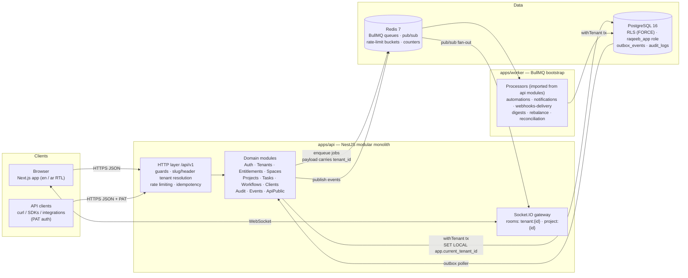
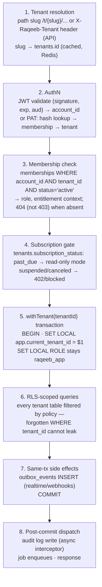

# Architecture Overview — Modular Monolith

> **Status:** Accepted.
> Raqeeb is a TypeScript modular monolith: one NestJS API process (HTTP + Socket.IO), one
> thin BullMQ worker process, one Next.js web app, one PostgreSQL 16 cluster with RLS pooled
> tenancy, one Redis. Services are split out only when scale demands it — never before.

## System diagram

Key properties:

- **One deployable API image** serves the web app's API, the public API (`/api/v1` — same
  controllers, no separate "integration API"), and the Socket.IO gateway.
- **The worker is thin**: it boots BullMQ and imports processor classes from the API
  modules, so domain logic lives in exactly one place. Every job payload carries
  `tenant_id`; a base processor re-enters `withTenant()` before any query
  (see `05-jobs.md`).
- **Postgres is the source of truth**, including for events: the transactional
  `outbox_events` table is written in the same transaction as the domain change, and a
  poller publishes to Redis pub/sub → Socket.IO (see `04-realtime.md`).
- **Redis is disposable**: queues are re-drivable from Postgres state, rate-limit buckets
  and counters degrade to plan defaults on loss. Nothing in Redis is the only copy of
  anything.

## Request lifecycle

Every authenticated HTTP request passes this pipeline, in order. WebSocket connections run
steps 1–4 at connect time and re-check membership on room join.

Rules encoded in the pipeline:

1. **Tenant resolution before auth** — the resolved tenant is context, not authorization.
   Authorization is the *membership check* (step 3); a valid JWT for tenant A gets `404`
   on tenant B's slug (existence is not disclosed).
2. **`SET LOCAL` only inside a transaction** (risk 1). `withTenant()` is the sole entry
   point to tenant data; there is no "raw pool query" API for tenant tables
   (see `02-tenancy-rls.md`, `03-data-access.md`).
3. **Outbox in the same transaction** — an event is emitted iff the change committed.
4. **Audit is post-commit and async** (interceptor → queue) so audit latency never blocks
   the request, but the audit record references the committed change.

## Module map (apps/api)

Modules are NestJS feature modules with enforced boundaries (ESLint import rules:
a module may import from `shared/` and from other modules' *public* index only).

| Module | Responsibilities | Wave |
| --- | --- | --- |
| **Core** | Zod-validated env config, pino logger setup, `/healthz` + `/readyz`, global exception filter (RFC 9457 problem+json), request-id middleware | A |
| **Database** | pg Pool, `withTenant()` / `withSystem()` helpers, AsyncLocalStorage tx context, Drizzle wiring | A |
| **Auth** | argon2id signup/login, JWT access+refresh (rotation, reuse detection), guards/decorators, Google SSO stub | A |
| **Tenants** | Provisioning (slug validation, seed defaults), slug middleware, memberships CRUD, invitations (Mailpit in dev), tenant lifecycle states | A |
| **Entitlements** | plans table access, `check(tenant, feature)` single enforcement point, `consume()` for metered counters (Redis + PG rollup) | A (gates live in P1) |
| **Spaces** | Space CRUD, ordering, privacy flag, default workflow binding | A |
| **Projects** | Folders (nesting ≤ 5), projects (key, counter, client link, workflow binding), sections | A |
| **Tasks** | Task CRUD, multi-homing (locations), assignees, status transitions (+ `completed_at` maintenance), fractional reorder, subtasks, dependencies with cycle rejection | A |
| **Workflows** | Workflow/status library CRUD, canonical-group validation, binding rules | A |
| **Clients** | Client CRUD (agency spine anchor) | A |
| **Audit** | Async interceptor → `audit_logs` writes; actor/diff capture | A |
| **Events** | Outbox writes, poller/publisher, Socket.IO gateway + room auth | A (stub broadcast) |
| **ApiPublic** | PAT issuance/verification, public-API concerns (idempotency keys, RateLimit headers) — same controllers as the app | A |
| Billing (Stripe) | Checkout/Portal sessions, webhook handler, seat reconciliation | P1 |
| Fields / Views / Comments / Notifications | Custom fields + cache, saved views, comments/mentions, notification fan-out | P2 |
| Time / Finance | Time entries, budgets, rate resolution, retainers, profitability | P3 |
| Resources | Allocations, work schedules, capacity | P4 |
| Automations / Intake / Portal | Recipe engine, forms, client portal permission matrix | P5 |

`apps/worker` imports processors from these modules and registers them against the queues
listed in `05-jobs.md`. `apps/web` (Next.js) talks only to `/api/v1` with the same
contracts package (`packages/contracts`, Zod → OpenAPI) used by the API — there is no
private web-only API surface.

## Why a modular monolith (ADR)

**Decision.** Single NestJS codebase, module-per-domain, one API deployable + one worker
deployable; extraction into services only when a concrete scaling or isolation need is
measured.

**Rationale.** A small team shipping a product with heavy cross-domain transactions
(task + location + outbox + audit in one commit) gets correctness for free inside one
database transaction. RLS tenancy is dramatically simpler with one connection discipline.
TypeScript end-to-end shares domain types from DB to browser (`packages/contracts`).

**Rejected alternatives.**
- *Microservices day one* (blueprint-1's "NestJS / Go microservices"): distributed
  transactions across task/outbox/audit, N× infra overhead, and no team to shard the
  services across. Deferred explicitly in the build plan.
- *Serverless functions*: SET LOCAL/transaction discipline and Socket.IO stickiness fit
  poorly; cold starts hurt the p95 budgets in `08-observability-performance.md`.
- *Separate "public API" service*: Teamwork's three concurrent API versions and drifting
  internal-vs-public surfaces are the documented failure; one controller set serves both.
