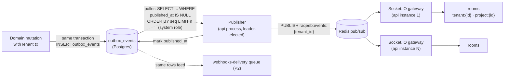

# Realtime — Outbox → Redis Pub/Sub → Socket.IO

> **Status:** Accepted. v1 realtime is **entity-change broadcasting**: clients keep their
> views live by applying (or refetching on) change events. Collaborative document editing
> (Yjs/CRDT) is explicitly deferred — see the ADR at the end.

## Pipeline



### Why an outbox (ADR)

**Decision.** Events are written to `outbox_events` in the **same transaction** as the
domain change; a poller publishes them to Redis afterwards.

**Rationale.** Emitting to Redis inside the request (dual write) loses events on crash
between commit and publish, or publishes events for rolled-back transactions. The outbox
makes "event exists ⇔ change committed" a database guarantee, gives webhooks and realtime
one shared, replayable source, and preserves per-tenant ordering via `seq`.

**Rejected alternatives.**
- *Dual write (commit, then publish from app code)*: lost/phantom events, no replay.
- *Postgres LISTEN/NOTIFY as the bus*: payload size limits, no persistence/replay, and
  incompatible with transaction-mode pooling (would need dedicated connections anyway —
  the poller uses one, but subscribers shouldn't).
- *Kafka/Redpanda*: operationally heavy for v1; Redis pub/sub + outbox replay covers the
  requirement. Revisit if webhook fan-out volume demands it.

### Poller/publisher

- Runs in the API process (leader elected via a Redis lock with TTL heartbeat; any
  instance can take over). Polls under the **system role** (cross-tenant by design,
  documented escape hatch in `02-tenancy-rls.md`).
- Batch: `SELECT ... WHERE published_at IS NULL ORDER BY seq LIMIT 500`, publish each to
  `raqeeb:events:{tenant_id}`, then set `published_at` in one UPDATE. Crash between
  publish and mark ⇒ re-publish on next poll ⇒ **at-least-once** delivery.
- Poll interval 250 ms idle, tight loop while batches are full; published rows are pruned
  after 7 days (retention window doubles as webhook replay buffer).

## Rooms and authorization

| Room | Joined by | Carries |
| --- | --- | --- |
| `tenant:{tenant_id}` | every authenticated socket of that tenant | tenant-wide events: membership changes, workflow/library edits, project created/archived |
| `project:{project_id}` | sockets that opened the project (server re-checks project visibility on join) | task/section/location/assignee/dependency events for that project |

- Socket connect runs the same pipeline as HTTP (JWT → membership → tenant), then joins
  `tenant:{id}`. Room joins are server-validated — the client asks, the server checks
  membership + project privacy before joining. Multi-homed task events fan out to every
  project room the task has a location in.
- On membership revocation the Tenants module emits a system event that force-disconnects
  the account's sockets for that tenant.

## Event envelope

One envelope for realtime and (later) webhooks — produced once at outbox-write time:

```json
{
  "id": "0198f3a2-7f2b-7cc3-9e11-2b45c1d0aa9b",     // outbox_events.id (UUIDv7) — dedupe key
  "seq": 48211,                                       // per-cluster monotonic; ordering hint
  "type": "task.status_changed",                      // catalog: docs/05-api-design/04-webhooks.md
  "occurred_at": "2026-08-22T14:03:22.114Z",
  "tenant_id": "0198f3a1-...",
  "actor": { "membership_id": "0198...", "kind": "user" },   // kind: user | pat | system | automation
  "entity": { "type": "task", "id": "0198..." },
  "scope": { "project_ids": ["0198..."], "space_id": "0198..." },  // fan-out routing
  "data": {                                           // fat payload: changed fields AND new values
    "changed": ["status_id", "completed_at"],
    "new": { "status_id": "0198...", "status": { "name": "Done", "canonical_group": "done" }, "completed_at": "2026-08-22T14:03:22Z" },
    "old": { "status_id": "0197..." }
  }
}
```

Rules:
- **Fat payloads**: changed fields *and* new values (plus old values where cheap), so
  clients and webhook consumers don't re-fetch (the anti-re-fetch lesson from Asana's
  skinny events). Truncation guard: payloads over 32 KB fall back to
  `{"changed": [...], "truncated": true}` and consumers refetch — expected to be rare.
- `type` names are the same catalog as webhooks (`task.created`, `task.updated`,
  `task.status_changed`, `task.moved`, `comment.created`, ...) — one vocabulary
  everywhere.

## Delivery semantics

- **At-least-once.** The poller re-publishes on crash; Socket.IO offers no guaranteed
  delivery, so clients must tolerate both duplicates and gaps.
- **Client dedupe by event `id`.** The web client keeps a rolling LRU (last ~500 event
  ids per room); duplicates are dropped.
- **Gap recovery by refetch, not replay.** On reconnect the client does not attempt event
  backfill; it refetches visible view data (cheap — views are cursor-paginated) and
  resumes streaming. `seq` lets a client *detect* a gap (non-contiguous per-tenant seq)
  and trigger the refetch early.
- **Ordering** is per-tenant best-effort (publisher preserves `seq` order per batch);
  clients treat events as "invalidate/patch" hints, and the server is always right.

## Client application pattern

- TanStack Query cache patching: an event either patches the cached entity (small, known
  shape) or invalidates the query key (list-affecting events like `task.moved`).
- Optimistic mutations reconcile via the echoed event: the mutator ignores its own event
  (matching `actor.membership_id` + a client-sent mutation id in `data.mutation_id`).

## Deferred: Yjs/CRDT collaborative docs (ADR)

**Decision.** No CRDT layer in v1. Task descriptions are last-write-wins with `updated_at`
conflict warnings; multiplayer block documents (monday workdocs-class) are a Phase 2+
feature that arrives with its own storage design.

**Rationale.** CRDT docs are a different product surface (persistent doc state, awareness,
offline merge) with heavy storage and protocol costs. The v1 jobs-to-be-done — live task
lists, boards, and multi-user visibility — are fully served by entity-change broadcast,
which is an order of magnitude simpler to run and to secure under RLS. Blueprint-1 put
"WebSockets/Yjs" in one box; the build plan explicitly split them and deferred Yjs.

**Rejected alternative.** *Ship Yjs now for task descriptions*: pays the full CRDT
complexity for the least collaborative field in the model, before there is a docs product
to justify it.
