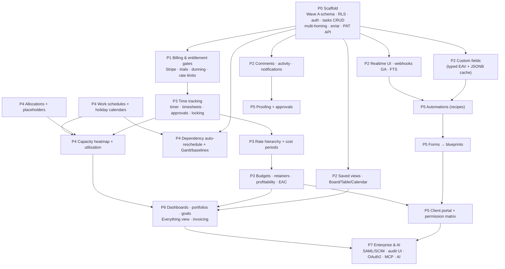

# Roadmap — Phase 0 through P7

> **Status:** Accepted. Phases are dependency-ordered, not calendar-boxed: each phase's
> exit criteria gate the next. Phase 0's precise scope (the scaffold) is in
> `02-scaffold-scope.md`.

## Feature-family dependency graph

Reading the load-bearing edges:
- **custom fields → automations** — recipe conditions/actions read and write fields;
  shipping rules before fields would mean re-shipping rules.
- **time tracking → financials** — every financial figure (budget burn, profitability,
  EAC) is derived from rate-resolved time entries; rates and cost periods sit between.
- **allocations + work schedules → capacity heatmap** — capacity math needs both the
  demand side (allocations, task estimates) and the supply side (per-person calendars);
  the heatmap is meaningless with either missing.
- **work schedules → dependency auto-reschedule** — date cascades must skip non-working
  days per person, or Gantt output is fiction.
- **forms → blueprints → client portal** — intake produces templated projects; the
  portal exposes intake and delivery to clients; portal permissions need the P5 matrix.

---

## Phase 0 — Scaffold (definition of runnable)

**Goals.** A runnable, seeded, CI-green monorepo that proves the architecture's four
riskiest bets (RLS pooled tenancy, multi-homing, fractional ordering, en/ar RTL) end to
end.

**Scope.** See `02-scaffold-scope.md` (normative): Wave A schema + RLS, module list,
seed, CI gates, runnable definition.

**Why first.** Everything else is built on these primitives; retrofitting any of the
four bets is a migration project (D2, D10, risk 1, risk 5).

**Exit criteria.** The definition of runnable holds from a fresh clone: signup →
provision → seeded project → create/status/reorder task in `en` and `ar`; same via
curl + PAT; RLS isolation suite green in CI.

## P1 — SaaS commercial core

**Goals.** Charge money safely; make plan gates real.

**Scope.** Stripe billing (checkout, portal, webhooks with event-id dedupe), 14-day
cardless Business trial, dunning → `past_due` read-only mode, seat counting + daily
reconciliation; entitlement gates live (boolean/limit/metered + overrides); per-tenant
plan-tiered rate limiting with `RateLimit-*` headers; tenant export + deletion jobs.

**Why now.** Billing state and entitlements shape every subsequent feature's gating;
building P2 features first would mean retro-gating them. Revenue also funds the rest of
the roadmap.

**Exit criteria.** A tenant can upgrade Free→Business by card and be correctly gated
within 60 s; simulated payment failure walks the full dunning path to read-only and
back; reconciliation corrects an artificially drifted seat count; rate limits differ by
plan in production.

## P2 — Work engine depth

**Goals.** Daily-driver credibility: the views and collaboration surfaces teams live in.

**Scope.** Custom fields (library + typed values + JSONB cache + nightly consistency
check); comments/mentions/activity (Stories-style event model); attachments (S3
presigned per the security doc); saved views + Board/Table/Calendar; My Work; Postgres
FTS; realtime broadcasts wired into the UI; webhooks GA + public API GA (OpenAPI +
llms.txt published); 50k-task nightly perf fixture goes live.

**Why now.** These are the retention features — a team that can't filter by its own
fields or discuss work in-place churns before financials ever matter. Automations (P5)
and dashboards (P6) both consume fields and views.

**Exit criteria.** Perf budgets hold on the nightly 50k fixture (task list p95 < 500 ms
@ 10k, board drag < 100 ms perceived); webhook deliveries pass the handshake/signature/
retry/auto-suspend contract; a real integrator scenario (Zapier-style) works with PAT +
webhooks only.

## P3 — Time & financials

**Goals.** The agency money engine: from logged minutes to margin.

**Scope.** Timer + timesheets + approval state machine + locking; rate hierarchy
(project override → client role rate → tenant rate card → user default) with
date-effective entries; `person_cost_periods`; snapshotted rates on entries; project
budgets (tm/fixed_fee/retainer/non_billable, convertible with recorded event);
retainer periods with rollover in/out + overage + locking; profitability + EAC per
project and task.

**Why now.** Depends on P1 (Business-tier gating) and P2 (fields/views to surface
financial columns). It is the wedge against Forecast's orphaned customer base and must
precede resource planning, whose utilization/cost views read the same rate machinery.

**Exit criteria.** A seeded agency scenario reproduces hand-computed budget burn,
retainer rollover across three periods, and margin per project to the cent; locked
periods refuse edits through UI and API; rate changes never alter historical entries.

## P4 — Scheduling & resources

**Goals.** Answer "who is doing what, when, and can we take this project?"

**Scope.** Dependency auto-reschedule (DAG cascade honoring work calendars); Gantt +
baselines; allocations UI (person XOR placeholder-role, tentative/confirmed);
work schedules + holiday calendars; capacity heatmap with Forecast's thresholds
(≤ 92% under / 93–106% healthy / ≥ 107% over); utilization report with billable
targets (default 80%).

**Why now.** Consumes P3's time/rate data (utilization, cost of capacity) and D7's
allocation model; auto-reschedule needs work schedules to produce real dates. This
completes the Business-tier agency promise.

**Exit criteria.** A dependency-chain date shift cascades correctly across weekends and
per-person holidays; heatmap matches hand-computed capacity for the fixture team;
tentative→confirmed allocation flows update demand without touching task assignments.

## P5 — Automations, intake & client portal

**Goals.** Self-running workflows and a client-facing surface.

**Scope.** Recipe-sentence automation engine ("When [trigger], only if [conditions],
then [actions]") with metered quota that **degrades gracefully, never mass-pauses**;
forms with conditional logic → blueprints with relative dates; client portal (free
client users, per-project ~25-toggle permission matrix, per-item privacy); proofing +
approvals with external email reviewers (no account required).

**Why now.** Rules need P2 fields (conditions) and the outbox event stream (triggers);
the portal needs P3 financial objects to hide/show correctly (cost-rate inference
warnings — the Teamwork lesson); proofing builds on P2 attachments + comments.

**Exit criteria.** The quota cliff test: a tenant 3× over its automation quota still
has every rule *running* (degraded band) with visible admin messaging; a client user
can approve a proof via email link without a seat, and can never see cost rates.

## P6 — Portfolio layer & scale

**Goals.** The management altitude: cross-project visibility, at speed.

**Scope.** Dashboards with widget library; portfolios (nestable, rollups) + goals with
auto progress rollup; **Everything view** under the < 2 s anti-ClickUp budget; exports;
Meilisearch adapter behind the search interface (Postgres FTS remains the default);
invoicing (from unbilled time & expenses or fixed price; invoiced time locks) +
Xero/QBO sync.

**Why now.** Rollups need everything below to exist (fields, financials, capacity);
performance work rides the nightly fixture that has been running since P2. Invoicing
completes the P3 money loop (Forecast/Teamwork parity).

**Exit criteria.** Everything view < 2 s on the 50k fixture; portfolio rollups match
per-project figures; an invoice round-trips to Xero sandbox and locks its time entries.

## P7 — Enterprise & AI

**Goals.** Move up-market; open the platform.

**Scope.** SAML SSO + SCIM; audit log UI + export; OAuth2 app platform with
`resource:action` scopes + service accounts; MCP server (agent-native surface);
AI layer (AI fields, auto-schedule, insights — Forecast's differentiator, done
transparently); schema-per-tenant option; BYOK/CMEK.

**Why now.** Enterprise controls monetize the trust built by everything prior; OAuth
needs a mature resource map to scope against; AI features need the accumulated
work/time/financial data to be worth anything; isolation options wait for a customer
who pays for them.

**Exit criteria.** An enterprise pilot completes SSO+SCIM onboarding without engineering
involvement; a third-party app ships against OAuth scopes in sandbox; one tenant runs on
schema isolation in production with unchanged application code.
